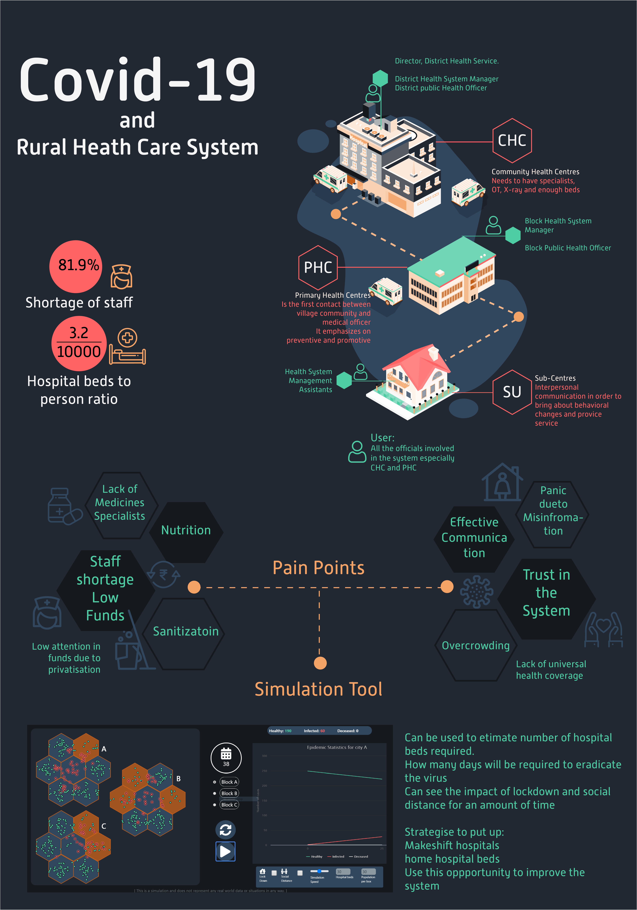
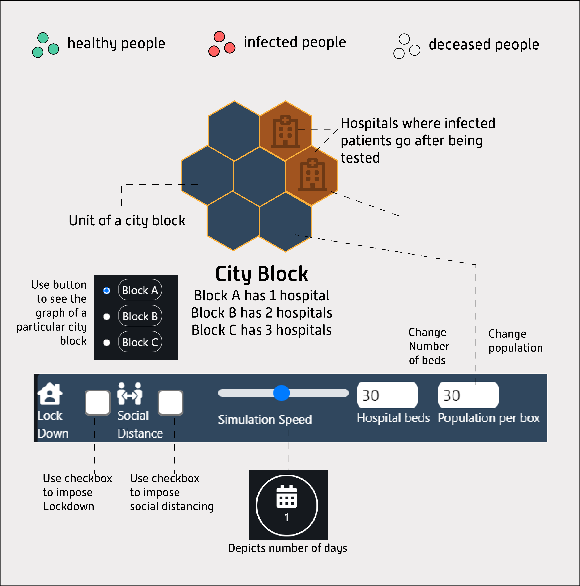

# Covid-19 and Rural India

The aim of the interactive [visualisation](https://anaghasontakke.github.io/) is to map the spread of COVID-19 in simulated cities so that responsible stakeholders can use it to strategies their further actions.

It formulates a relationship between the number of hospital beds, number of infected and deceased people, population density, spread ratio, lockdown effect, social distancing effect and the estimated days of eradication of epidemic.

The designing process involved research, analysis of the information, formation of insights, identification of problem statement and development of a prototype. While going through a lot of material and personal experiences, we came to know that people have very less information which is mostly about the ratio of deaths and red zones. They don't have the agency to understand how will they stand in the future. After researching about several stakeholders involved in the pandemic we anchored around the health care system. The health care system lacks the ability to cope up with the demand. The second most important factor was the miserable condition of rural India. We involved keyword mapping of all the pain points and the emotional aspect of rural health care systems. The ratio of hospital beds is 3.2 per 10,000 people which brings up the need for strategy making by ground-level officials. We believe that rather than sitting with huge data sets we can simplify the maths by having a visualisation tool to their disposal. This visualisation tool will help them understand how to manage their limited resources and start strategizing for makeshift hospitals or more innovative solutions such as home hospital beds. It also tells when the epidemic will end and provides a visual comparison of the varying number of hospital beds. The user is primarily Director, District Health Service, District Health System Manager and
District Public Health Officer who can vary mentioned parameters and know number of hospital beds required.

This solution is selected as a winning entry in [D'source DCDC-8 - Information Design Challenge](https://dsourcechallenge.org/results.html) . The project was designed by @shalaka1110 and developed by me. It can be viewed [here](https://anaghasontakke.github.io/).